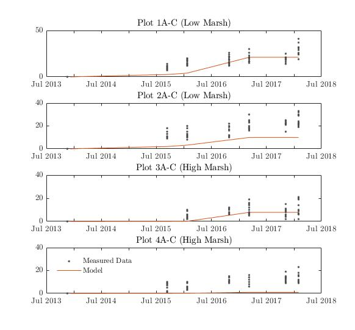

Abstract
===============================================================

In urban watersheds innovative sediment management approaches have the potential to reduce costs and increase efficiency in the operations of local agencies, and help ensure salt marsh species persistence.Future uncertainty in SLR, complex marsh dynamics, and competing habitats in the marsh make it challenging to evaluate the effectiveness of management scenarios. Here, we demonstrate a series of modeling approaches that can be applied to investigate physical changes to marshes as a result of SLR and sediment management.  We then predict the biological changes driven by the physical changes. We apply the approach at a salt marsh is southern CA, which has high importance biologically and recreationally, and experiences highly managed sediment in the watershed and bay. This is a test

<!--- this is just some filler text, we need to work on it! --->


Keywords
===============================================================
Sea level rise, coastal salt marsh, Delft 3D, habitat suitability, sediment management, Ridgway's rail, Belding's savannah sparrow


Acknowledgments
==============================================================
This work was funded by the National Oceanic and Atmospheric Association (NOAA) Ecological Effects of Sea Level Rise program <!--- funding number--->.  We thank Dick Zembal from Orange county water district for his maps showing the annual locations of breeding Light-footed Ridgway’s rails. We thank Amber Jolly and Kyle Zolkin for the many hours they spent helping to georeference and digitize 8 years of survey data.  We thank Karen Thorne from the USGS Western Ecological Research Center for her elevation and vegetation data from surveys in Upper Newport Bay.  Lastly, we thank all the individuals who have participated in the Ridgway’s rail and Belding's savannah surveys at salt marshes in southern California.
<!--- did I miss anyone?? anyone who helped you with delft? --->


Introduction
===============================================================

Urban estuaries are embayments open to the coastal ocean that receive freshwater runoff, are characterized by urban development around the embayment and/or in the watershed [@Pritchard1967], and are under significant pressure related to land reclamation, waste discharges, and climate change [@lotze2006]. Urban estuaries represent critical coastal habitats that support ecosystems including birds, fish and invertebrates [@mclusky2004]. Additionally, urban estuaries provide benefits to society (or ecosystem services) including recreational opportunities for coastal communities, pollutant and nutrient processing, support for the shipping, defense and fishing industries, and urban amenities such as access to wildlife, seafood, and open spaces [@barbier2011]. These many benefits are often in competition and need to be balanced, thus posing challenges for management [@elliott2011].  

<!--- Jenny, maybe you could add in a section on more specifics for the biological benefits urban estuaries provide, then we can go into how modelling leads to better conservation planning, importance of modelling, and ideas for research gaps we are filling  --->

<!---  some ideas for 'gaps' we are filling:
1. challenge of predicting marsh impacts of SLR due to all the natural and anthropogenic drivers in urban watersheds, 
2. challenges of managing for endangered species with an uncertain future
3. need to evaluate new methods of marsh management for SLR (like sediment mgmt) when options like habitat transgression are not possible
4.  need to reevaluate management requirements (like sediment mgmt) under climate change--->


High resolution dynamic coastal modeling leads to better conservation planning [@Runting2013]. 


Methods
===============================================================

### Study region
This study focused on a coastal salt marsh in Southern California, Upper Newport Bay (33.6463°N, -117.8862°W), which experiences a Mediterranean climate.  The lower portion of the bay is dredged and managed as a recreational harbor. The upper part of the bay - the focus of this study - is managed as an ecological reserve by the California Department of Fish and Wildlife and has approximately 752 acres of land including sub-tidal, mudflat, and salt marsh habitat.  The upper bay supports non-motorized recreation and lots of wildlife including migratory birds.  This reserve is particularly important because for the past few decades it has supported the largest population of the LFRR, which is an endangered species and endemic to the region.  Additionally, it supports a large population of Belding's savannah sparrow, a threatened salt marsh bird.  The upper bay is surrounded by steep bluffs, which make marsh transgression not possible.  Instead, the marsh will rely on accretion only to keep pace with sea level rise.

Two rivers empty into the upper bay: San Diego Creek (SDC) and the Santa Ana Delhi channel, both of which drain heavily urbanized watersheds. The Santa Ana Delhi channel does not contribute a significant proportion of sediment due to its heavily urbanized upstream watershed. Historically, excessive sedimentation from SDC was the greatest driver of habitat change in Newport Bay, threatening to turn protected wetlands into upland habitat [@Trimble1997]. As a result, a sediment total maximum daily load (TMDL) for SDC was implemented, stipulating a 50% reduction in overall sediment loads in addition to maintaining a minimum depth of 2.1 meters below MSL for subtidal habitat in Upper Newport Bay (UNB) [@sedTMDLNB2014]. Upstream, extensive channel armoring and sediment detention basins have been sucessfull in reducing the overall sediment loads into Newport Bay by at least 50% [@sedTMDLNB2018].

Downstream of SDC, Newport Bay contains two sediment capture basins constructed in 2010 at a cost of $37 million dollars as part of the sediment TMDL with estimated lifespans of 20 years [@ACOE2011]. These basins capture excessive upstream sediment generated from the watershed and channel. The basins are also meant to protect subtidal habitat and must be periodically dredged when they fill to above 2.1 meters below MSL. When this "trigger point" is reached, the TMDL stipulates that the basins are dredged to their original depths at 6.65 meters below MSL. 

<!--- Matt, would this be a good section to add in some information on the dredging and maintanence of the watersheds and the dredging of the bay... or do you think that woudl be better in the Delft3D seciton? --->

### Delft3D Model Description

A two-dimensional (depth-integrated) model was constructed with a domain including the lower part of the San Diego Creek, Newport Bay and a nearshore zone using Delft3D (version 4.01.01), which resolves fluid flow, sediment transport, and morphodynamics at fine spatial and temporal scales and has numerous studies validating its use [@lesser2004, @elias2001, @hu2009]. Delft3D was configured with an inland inflow boundary where the instantaneous volumetric flow rate and sediment load is specified, and an open boundary around 8 km offshore where water level is specified.  The model mesh contains approximately 46,519 cells with high resolution in the bay and a minimum cell size of 5 m. The computational mesh and flow resistance parameters are based on a hydrodynamic calibration and validation described in [@guo2018]. Bed erosion parameters in the Delft3D model were developed from field measurements and computational experiments [@stein2014characterizing]. Morphological basin change calibration and validation is reported in Brand et al., 2020 (work still needs to be published). Five-minute interval flow data for 2010 to 2015 was used to specify the freshwater inflow from SDC (and sediment loading based on sediment transport curves) and six-minute interval tide measurements from Los Angeles were used to specify the water level at the offshore open boundary of the model. Calibration involved the manual adjustment of several parameters including the sediment curve, erosion/sedimentation thresholds, and dry density of mud within physically reasonable ranges. 

A morphological acceleration factor is usually used to achieve decadal to centennial morphodynamic changes [@ranasinghe2011morphodynamic], but in this study, spatially distributed bed levels were updated at each hydrodynamic time step which corresponds to a morphological acceleration factor of unity. A sensitivity analysis using the highest tidal ranges (spring tide in January) and lowest erosion parameters measured in the bay (threshold for erosion = 0.19 $\frac{N}{m^2}$) found that little to no morphological changes occur during dry weather ($<1\%$ of yearly morphodynamic change). Based on this analysis, dry weather events ($<100$ cms) were ignored for the calibration and validation phases of the Delft3D modeling, and time integration of the Delft 3D model was limited to the periods of time when SDC streamflow exceeded 100 cms.

The model is driven by river discharge at Campus Drive and by tides at the ocean boundaries. Two sediment fractions, one non-cohesive sand (grain size of 100 $\mu$m) and one cohesive mud (settling velocity of 0.25 $\frac{mm}{s}$), are imposed to simulate sediment erosion and deposition patterns. The sediment transport boundary conditions of sand are prescribed by equilibrium concentrations, suggesting that there is unlimited sand source at the boundary and zero gradient in the boundary cells. The concentrations of mud are defined by the sediment rating curves (see Figure SX) assuming a mud content of 95%, based on 25 years of flow and sediment measurements by OC public works [@TMDLAR2014]. Five-minute-high resolution flow data collected by OC Public Works for 2010 to 2015 were used as forcing data for the Delft3D model calibration/validation for both the wetlands and basins (Personal Communication, OC Public Works).

The dry bed densities are 1,600 $\frac{kg}{m^3}$ and 350 $\frac{kg}{m^3}$ for sand and mud, respectively. The [@van1993principles] formula is employed to calculate non-cohesive sand transport in which both bed load transport and suspended sediment transport are taken into account. Details of the [@van1993principles] formulae can be found in the user manual of Delft3D [@Delft3Dmanual] and [@van1993principles] thus are not repeated here. For cohesive sediment, the Partheniades-Krone formulation is applied to calculate mud transport [@partheniades1965erosion]. The critical erosion and deposition shear stresses of the mud are 0.5 and 0.11 $\frac{N}{m^2}$, respectively, suggesting that erosion only happens when the calculated bed shear stress is >0.5 $\frac{N}{m^2}$ and deposition occurs when shear stress is <0.11 N/m2 [@stein2014characterizing, @Delft3Dmanual, @RMA1998]. 

A two-dimensional approach was used over a three-dimensional formulation because Newport Bay is well mixed under no and low river discharges (tide-dominated) and saline intrusion is limited under storm river discharges, and sensitivity analysis revealed negligible changes in deposition (Table 1). 

### Future Simulation of SDC Flows

Future inflows of sediment and water into UNB from SDC were simulated as follows. First, a Monte Carlo Markov Chain (MCMC) model was developed and used to generate potential future inflows from 2013-2100 for SDC [@richardson1981stochastic]. This MCMC algorithm first calculates the empirical probabilities of being in a wet vs dry year (wet year being defined as above the historical mean, dry being below) and separates the two years flows. Then, the algorithm calcuates the empirical probability of exceeding baseflow for a given day (P01), and a random number is drawn. If the number exceeds the probability of having a wet day, flow is generated from a log-normal distribution. The code then calculates the empirical probability of again exceeding the baseflow conditioned on exceeding baseflow the first day (P11), and again draws a random number. If the random number exceeds the empirical P11 parameter, flow is again randomly generated for that day from the log-normal distribution. This process is repeated until the random number is below P11, at which point the simulation reverts to baseflow. 

This MCMC simulator is run for 2,000 simulations to generate a distribution of potential future peak flows on a daily timescale (Figure SX). The flows are then summed over the 87 years, and ranked to find the median total inflow from SDC. This simulation was then used to drive future flows of the Delft3D model.

Running every flow event would result in unreasonably long model runtimes, even on an HPC system. Therefore, flow events under a peak of 200 cubic meters per second were removed from analysis. Analysis was performed to find the total percentage of sediment flux this methodology captures - using a site specific empirical relationship between peak flow and sediment yield from OC Public Works [@TMDLAR2014]. This methodology finds that roughly 79% of total future sediment yield is captured when filtering storm events below 200 cms. Using this methodology, model runtimes for 87 years of simulation took about 40 days to simulate on a 64 core HPC system using a MPI parallelization routine.

### SLR Boundary Conditions

### Delft3D Wetland Model Evaluation
The model for wetland accretion was developed using SET table data and feldspar measurements collected at two sites, one in an upper marsh and one in a lower marsh from UNB by [@Thorne2018]. [@thorne2016effects] found little to no organic sediment accumulation in UNB marshes, indicating that a purely physical accretion model such as Delft3D would be appropriate for modeling future sediment accumulation. In addition, no parameters were modified from the basin model to better fit the wetland model, so all time periods are model evaluation compared to calibration. Figure X shows the results of the wetland model evaluation.

  

From Figure X, the Delft3D model shows reasonable agreement to the data and is within error ranges of previous literature (refs), with the exception of plot 4A-C. Plot 4A-C shows that the model predicts almost no accretion while the data is suggesting up to 23 millimeters of observed accretion. There could be multiple reasons for this. Due to plot 3A-C showing reasonable agreemement between the model and data for the other high marsh plot, it is likely that the model resolution is unable to fully resolve the processes contributing to sediment dispersal for the high marsh in some areas. Previous literature suggests that tidal channels (on the scale of $<1m$) are responsible for sediment transport in high marsh regions. The Delft3D model used is unable to rectify those channels at the 5 meter resolution scale, resulting in the mismatch between model and data. It was not feasible to increase Delft3D model resolution due to computational modeling time constraints, so the 5 meter resolution was maintained. Therefore, it is likely that upper marsh deposition could be underpredicted.

### Overview
Habitat suitability models were developed for two salt marsh obligate species, the Light-footed Ridgways's rail *Rallus obsoletus* (LFRR), and the Belding's savannah sparrow *Passerculus sandwichensis beldingi* (BSS) using marsh surface elevation and vegetaion.  We used Delft3D modeling to predict marsh surface elevation  in 2050 and 2100 using two different sea level rise scenarios (associated with two different RCPs) and two different marsh dredging scenarios.  We used the scenario results from Delft3D modeling to make predictions for suitability for the two birds under the different sea leverl rise and sediment management system.   

### Light-footed Ridgway's rail model
The LFRR is a sub-species of Ridgway's rail endemic to salt marshes in southern California and northern Mexico, which has only recently been identified as a separate species from the Clapper rail [@Maley2013]. While nest sites have been observed in different vegetation settings, generally the LFRR is known to prefer tall cordgrass (*Spartina foliosa*) for nesting and foraging [@Zedler1993, @Zembal1988, @Massey1984]. We therefore used the maximum height of cordgrass as our indicator for the suitability of the salt marsh under the potential surface elevation scenarios.  The modeling for the LFRR consisted of three steps:  1. Develop model to predict *S. foliosa* maximum height from marsh surface elevation, 2. Predict habitat suitability for the LFRR using the maximum height of *S.foliosa*, and 3. Use marsh surface modeling to predict the surface elevation under different sea level rise and sediment management scenarios.   

#### Model for *S. foliosa* maximum height
<!--- I need to add in the method for interpolation that I used for the vegetation and for the elevation --->
To develop a model for maximum height of *S. foliosa* we used a zero-inflated negative binomial model [@mullahy1986]. For a thorough review of zero-inflated models see the review by @ridout1998.  In our model, the height was modeled with annual inundation during the summer month and annual inundation during the summer month squared, and the binomial was modeled with annual inundation during the summer month. This allowed us to first predict the presence or absence of *S. foliosa*, and if present, we predicted the maximum height.  To calculate inundation during the summer months, we used elevation data (NAVD88) collected with RTK-GPS at 1,037 points in a portion of the marsh in the winter of 2012 [@Thorne2018]. We subtracted hourly water level (NAVD88) recorded from a National Oceanic and Atmospheric Association (NOAA) gauge in 2012 from the elevation over the entire year.  Any time the subtraction yielded a negative number, it signified that that part of the marsh was submerged.  We then calculated the percentage of the summer months (April - September) that that part of the marsh was submerged. We focused on the summer months because that is the growing season in southern California.  

In addition to recording elevation in their 2012 survey, @Thorne2018 documented vegetation characteristics at a subset of the points they measured elevation, including: the heights and percent covers of each vegetation species.  we used the inundation metrics to model and predict the maximum height of *S. foliosa* using a zero-inflated model described above, and all the variables were significant at the P<0.001 level.  To predict with a zero inflated model, we used the model to predict a “response”, or a numerical value for the *S. foliosa* height, and a “zero” or a probability of the maximum height being zero (which is interpreted as no *S. foliosa* present).  If the probability of a zero was greater than 0.5, we assigned that value to be 0, and if it was less than 0.5, we assigned it to be 1. Then we multiplied the “response’ and the “zero” together such that the final value was 0 is the prob of 0 was >0.5 and it was a numerical height if the probability of zero was <0.5.  When using this model for prediction on the training data (2012), 5.8% that show *S.foliosa* presence when in fact there was no *S. foliosa* observed (a false positive), and 6.2% that show no *S. folida* when in fact it was observed (a false negative).<!--- 5.8 % is 14/240 and 6.2% is 15/240 ---> The model for *S. folisa* maximum height was applied to baseline years 2011-2018 using the NOAA water level data for the appropriate year and the elevation for the marsh surface calculated by subtracting or adding the average wetland accretion annual rate to the measured 2012 data. The average annual accretion rate was measured from surface elevation tables at Upper Newport Bay (Cite Karens Data, ask her how).  While we do not have *S. foliosa* maximum height for these other years to provide additional model validation, we will use the predicted maximum height to predict the habitat suitability for LFRR, which we can validate with annual LFRR surveys during those years.

#### Habitat suitability
We modeled LFRR habitat suitability using measures of *S. foliosa* maximum height and LFRR occurrence. The maximum height of *S. folisa* was derived for the yeras 2011-2018 using the method described in the previous section.  The LFRR occurrence data was compiled from surveys conducted from the 2011 breeding season through the 2018 breeding season for Upper Newport Bay [@Zembal2016]. Briefly, the surveys employ ‘evening clappering’ call counts - the surveyor walks around the marsh at the start of breeding season and listens for LFRR calls from pairs vocally defending their nests or advertising for a mate.  If no calls are heard, a recording of a LFRR call is played to elicit a response from a pair who thinks their territory is being intruded upon.  The type of call indicates if the location is a nesting territory.  The location of the call is recorded on a marsh map.  The 2011-2018 LFRR survey maps were georeferenced using ArcGIS version 10.6 and a buffer was added surrounding each point to address uncertainty. <!--- add in supplement to explian how the buffer was added--->   

We used RStudio to partition the area of Upper Newport Bay, subtidal through upper marsh habitat, into approximately 0.40ha plots, which represents the average area per LFRR nest (R. Zembal per. comm.).  Modeling at this scale prevents over predicting the carrying capacity of the marsh.  Each plot was assigned a percentage of years occupied, out of eight total years (2011-2018), depending on the number of years that a georeferenced LFRR survey point or buffer occurred within, or intsected, the plot. 

We trained a logistic regression model with eight weights to predict the percentage of years (out of eight total) that a LFRR occupied a plot.  We used two measures of maximum *S. foliosa* height: The percentage of the plot with the maximum *S. foliosa* value greater than 60cm [@Zedler1993] and the 95th percentile value of the distribution of maximum *S.folisa* heights. To calculate these two measures, using the Raster package in R, we extracted all the predicted values for the maximum *S. foliosa* heights within each plot and then calculated either the perentage greater than 60cm or the 95th percentile. P-values were significant at the P<0.001 value and odds ratios were greater than one suggesting a postive effect on LFRR occupancy. 

Model confidence is estimated by the upper and lower bounds of the 95% confidence interval for the predicted habitat suitabilty value using the following equation (i.e. the predited percentage of years that LFRR occupied a habitat).

$$\text{SE}(logit(p)) = \sqrt{\text{SE}({\beta_0})^{2} + {x_1^{2}}\text{SE}({\beta_1})^2 + {x_2^{2}}\text{SE}({\beta_2})^2}   $$
$$logit(p) \pm 1.96(\text{SE}(logit(p)))  $$

```{r echo=FALSE}

load("C:/Users/JennyT/Documents/LitReview/UCI/working data/mdl_pct_rail_pres.rda")
#calculate the standard error of the predicted value ie SE(logit(P)) = sqrt((SE*B0^2)+(x^2*SE*B1^2)....)
#the 95% CI is logit(P)+/-1.96(SE(logit(P)))
#then we do the inverse logit to go from upper and lower bounds in log odds, to upper and lower bounds of probability

b0_squared <- (summary(mdl_pct_rail_pres)$coefficients[1,1])^2
b1_squared <- (summary(mdl_pct_rail_pres)$coefficients[2,1])^2
b2_squared <- (summary(mdl_pct_rail_pres)$coefficients[3,1])^2
SE0 <- summary(mdl_pct_rail_pres)$coefficients[1,2]
SE1 <- summary(mdl_pct_rail_pres)$coefficients[2,2]
SE1 <- summary(mdl_pct_rail_pres)$coefficients[3,2]
```


### Belding's savannah sparrow model
The Belding's savannah sparrow, *Passerculus sandwichensis beldingi* is a subspecies of savannah sparrow that nests in the upper marsh zone in southern California and is currently listed as a threatened species.  The sparrow nests on or near the ground underneath low growing plants in the upper marsh zone. They are commonly associated with *salicornia pacifica* however, the other low growing plants in the upper marsh zone are also frequenty used.  They build their nests above the elevation that gets inundated by the high tides in the Spring [@Massey1977].  The modeling for the BSS consisted of two steps:  1. Predict habitat suitability for the BSS using the inundation time during the Sprng and Summer and 2. predict habitat suitability in future years using marsh surface modeling to predict the surface elevation under different sea level rise and sediment management scenarios.

#### Habitat suitability
Surveys for the BSS occur every five years and we used the results from the most recent survey done in 2015 [@Zembal2015].  These surveys record the presence of territorial birds, which are identified with behaviors such as singing, aerial chases, and prolonged perching (see @Zembal2015 for full details).  


#### Future predictions


##### Marsh surface modeling

<!---Delft 3D section ---> 


##### Habitat suitability
We applied both biological models to the future scenarios that were modeled using the Delft3D: Sea level rise of 0.39624m SLR (lower bound of the SLR for RCP 4.5 in 2100) and 1.09728m (higher bound of the SLR for RCP 8.5 in 2100), which encompasses the likely range for RCP 4.5 and 8.5 [@Griggs2017].  For each sea level rise scenarios, we modeled a scenario where dredging in the salt marsh continues as is, and a scenario where there is no dredging in the salt marsh. To calculate the percent of time inundated in the summer months nesessary to predict the maximum height of the *S. foliosa* we used water level data from the same NOAA gauge for the years 2011 and 2015, but we added the appropriate amount of sea level rise to each hourly water level value. The year 2011 represted a normal year and the year 2015 represented an el nino year.   


Results
===========================================================


<!---  results for the models used, S. foliosa max model, and probability of occurrence for the LFRR  --->

```{r}
load("C:/Users/JennyT/Documents/LitReview/UCI/working data/SPSP_MAX_model.rda")
summary(mdl_sp_max) #need to make this into a nice table

```


<!--- Spatial maps of %inundation, S foliosa, LFRR suitability, BSS suitability with 2 scenarios, 
1. RCP8, 2100, el nino, dredging as the most likely to be submerged but the business as usual
2. RCP4, 2100, normal, no dreding as the most sediment  --->


2.	Stacked bar chart comparing habitat outcomes under the different scenarios
a.	Elevation zones, vegetation zones, suitability zones

3.	Table showing acreage of habitat occupancy with
a.	SLR and business as usual sediment management
b.	SLR and no dredge
c.	SLR and, dredging as usual, and augmentation

References
============================================================

